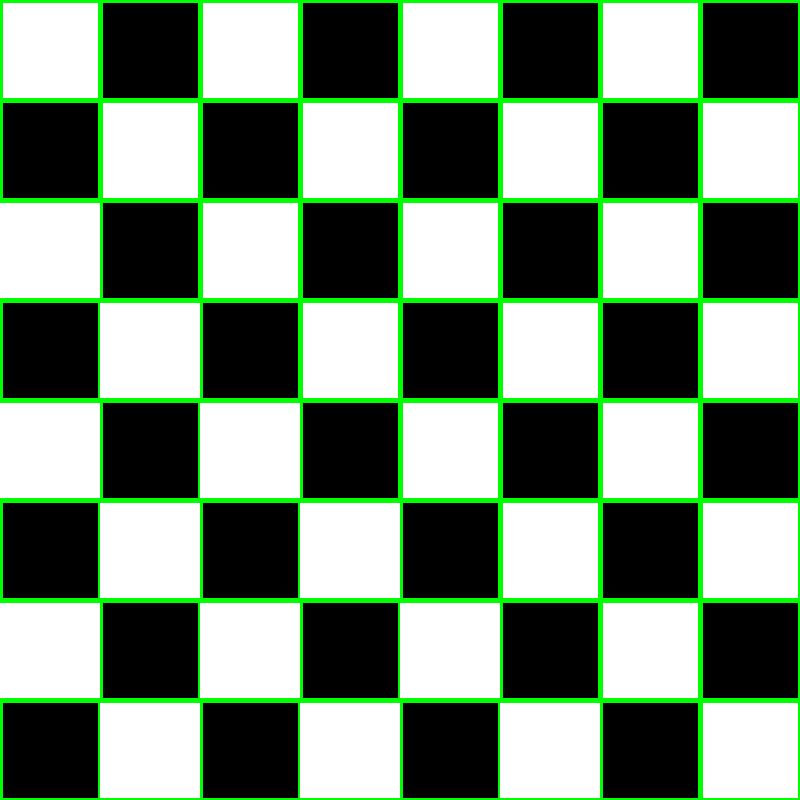
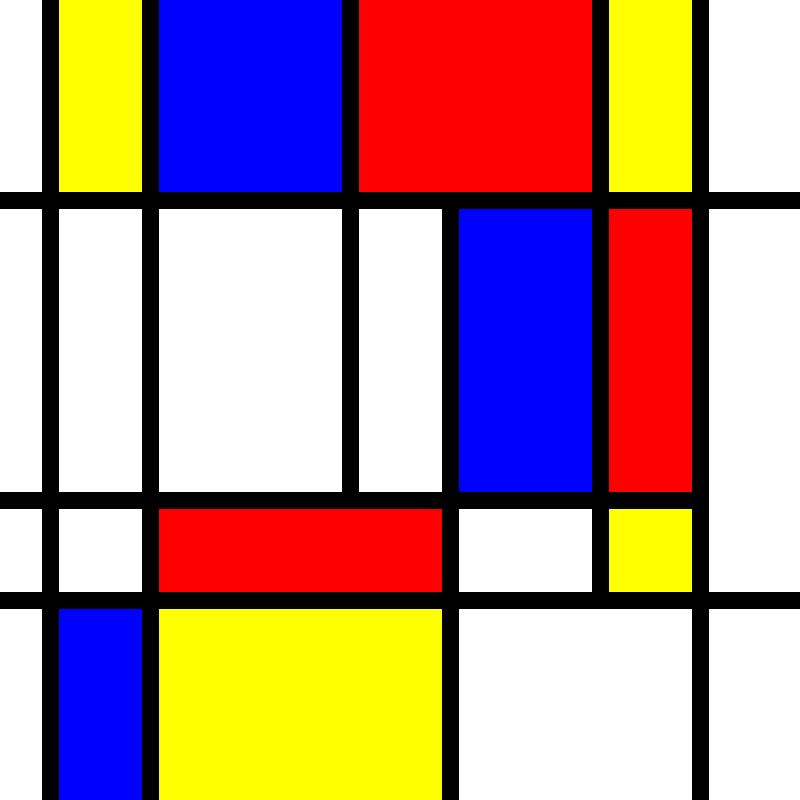
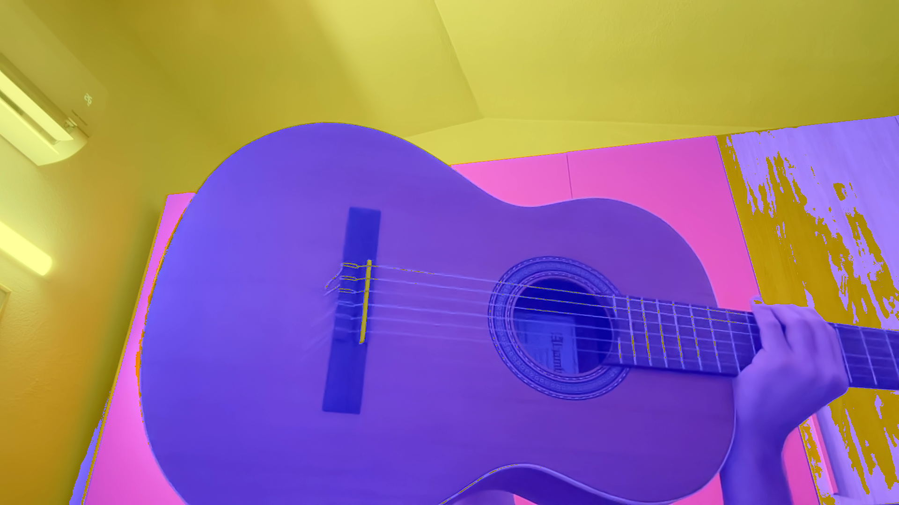
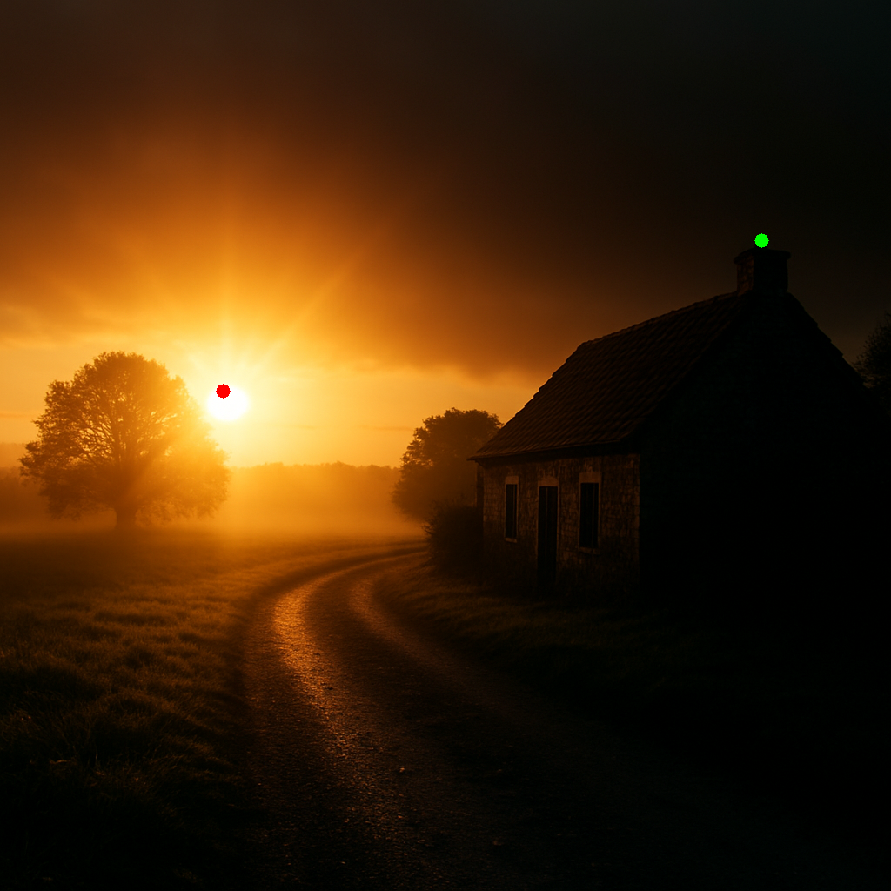
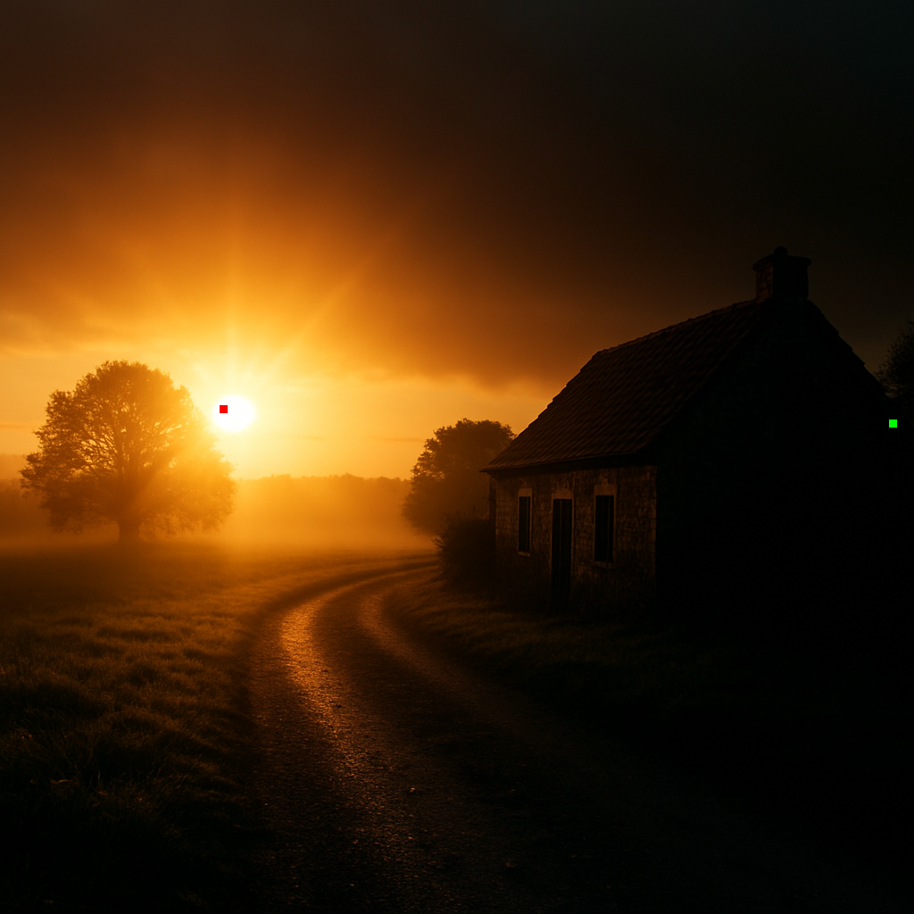
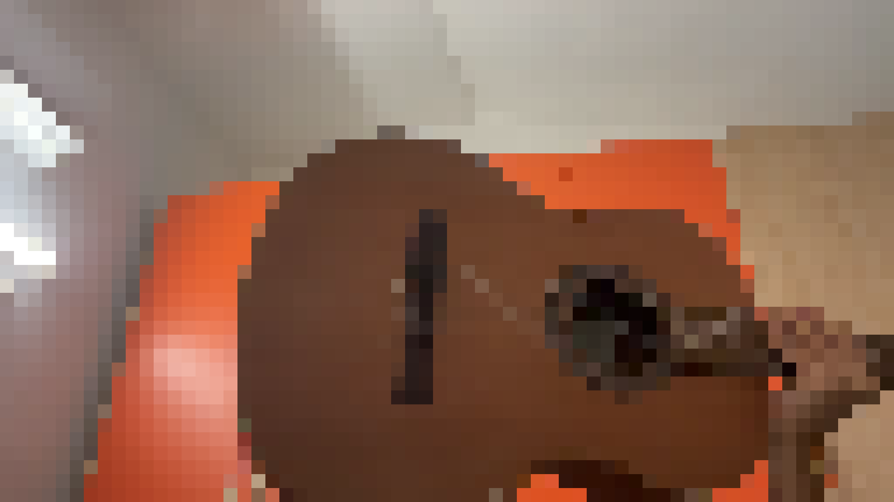

# trabajo_ComputerVision_ULPGC

This repository contains the work done for the Computer Vision course at ULPGC. It includes various projects and assignments related to computer vision topics. The code is primarily written in Python and utilizes libraries such as OpenCV, NumPy, and Matplotlib.

# Projects

**P1**: the first trabajo consists of a notebook that implements this tasks:

1. Create an image, e.g. 800x800 pixels, with the texture of a chessboard:

    to do this i colored the pixel in a way that the even rows and columns are white, and the odd ones are black. The result is a chessboard pattern.
    After that, i drew the lines

    

2. Create an image in the style of Piet Mondrian:

    I exactly created the example image from the ReadMe, creating first the lines, and then filling the right rectangles with the corrisponding colors

    

3. Freely modify the values of one channel of the image

    to complete this task, i edited the blue channel of the image, subtracting 100 to it

    

4. Draw circles at the positions of the brightest and darkest pixel in the image. What if you wanted to do it over the brightest/darkest 8x8 region?

    to do this task i choosed this image, created by chatGPT:

    

    i then computed the mean of values of each channel of each pixel of the image and then found the brightest and darkest pixel, drawing a circle over them

    

    to do the second parte of the task, i checked all the possibile 8x8 region, and found the brightest and darkest one, drawing a rectangle over them

    

5. Draw a rectangle over a region of the image, and fill it with a color

    for this task i got ispiration from the one used in the notebook provided. The pop art effect is the blur of the image

     
